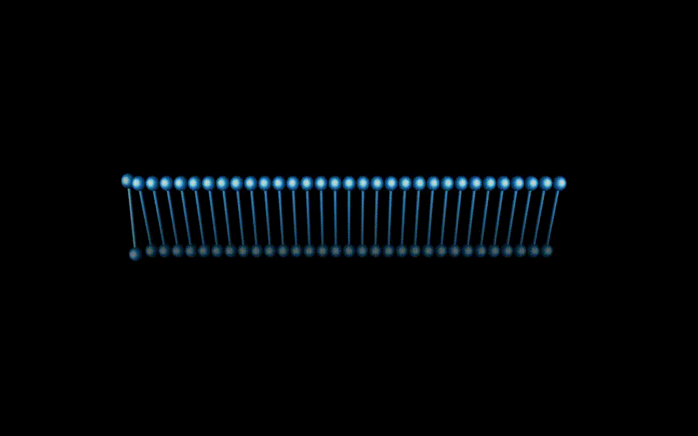

#### Gl Helix
A very basic demo I've written in C++ (2003) while learning OpenGL, actually most of it a boilerplate code for window creation/destruction and error handling.

> It was written as a screen saver for windows but i think the [executable file](./release/helix.exe) will work with wine on linux.

